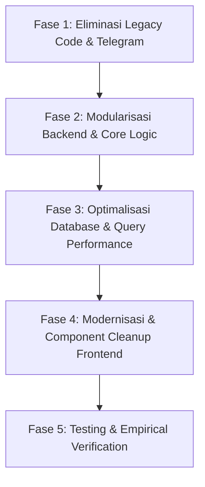

# 🚀 Rencana Refactoring Codebase HR Analyst

Dokumen ini berisi **Implementation Plan** untuk merefactor seluruh codebase HR Analyst (Backend & Frontend) agar lebih efisien, cepat, bersih, dan mudah dipelihara (*maintainable*), dengan menghapus fitur *legacy* (seperti Telegram Bot) tanpa mengubah fungsi utama sistem.

---

## 🎯 Tujuan Refactoring

1. **Efisiensi & Kecepatan**: Optimalisasi eksekusi query database SQLite, mempercepat pencarian data karyawan/cuti, serta mengurangi latensi balasan Chatbot WhatsApp.
2. **Eliminasi Code Slop & Legacy Code**: Menghapus seluruh modul Telegram (`telegram.py`, `bot_polling.py`), kolom/atribut Telegram yang tidak lagi terpakai, dan fungsi-fungsi *redundant*.
3. **Modularisasi Structure**: Memecah file monolithic yang besar (seperti `whatsapp.py` ~50KB) menjadi modul-modul kecil yang rapi dan terisolasi.
4. **Resiliensi Session**: Memperbaiki penyimpanan *session state* percakapan WhatsApp agar tidak hilang saat server di-restart.

---

## 📋 Tahapan Refactoring (Phase by Phase)



---

### 1️⃣ Fase 1: Eliminasi Legacy Code (Pembersihan Telegram)

| File / Komponen | Tindakan Refactoring | Rationale |
| :--- | :--- | :--- |
| `backend/app/routers/telegram.py` | ❌ **Hapus Total** (54 KB) | Pengajuan & notifikasi sudah 100% migrasi ke WhatsApp Cloud API. |
| `backend/bot_polling.py` | ❌ **Hapus Total** | Bot Telegram long-polling tidak lagi digunakan. |
| `backend/app/models.py` | ✂️ Hapus kolom `telegram_user_id` & `telegram_chat_id` | Menghilangkan atribut yang mati di model `LeaveRequest` & `Employee`. |
| `backend/app/schemas.py` | ✂️ Clean-up Pydantic Schemas | Menghapus opsi Telegram dari schema request/response API. |
| `backend/app/routers/leaves.py` | ✂️ Hapus import & panggilang notifikasi Telegram | Notifikasi persetujuan hanya dikirim via `send_whatsapp_leave_status_notification`. |
| `frontend/app/(app)/*` | ✂️ Hapus UI Telegram ID | Menghapus kolom/badge "Telegram ID" di tabel Cuti/Izin & Karyawan. |

---

### 2️⃣ Fase 2: Modularisasi Backend & Core Logic

File `whatsapp.py` saat ini menampung ~1250 baris kode (HTTP client Meta, Parser Tanggal, State Machine Form, dan Webhook Router).

**Rencana Pemecahan (`backend/app/services/whatsapp/`):**

```text
backend/app/
├── services/
│   └── whatsapp/
│       ├── __init__.py
│       ├── client.py        # Wrapper HTTP Client Meta Cloud API (send text, buttons, list, download media)
│       ├── parser.py        # Helper parser tanggal (YYYY-MM-DD, 'hari ini', 'besok') & waktu (HH:MM)
│       ├── state_manager.py # Pengelola State Percakapan (dengan TTL / auto cleanup)
│       └── handlers.py      # Logic alur percakapan per-step (Cuti, Sakit, WFL/Absen Luar)
└── routers/
    └── whatsapp.py          # Ringkas (hanya berisi FastAPI GET/POST Webhook endpoints ~80 baris)
```

**Keuntungan:**
- Kode lebih mudah dibaca, di-debug, dan diuji (*unit testable*).
- Menghindari duplikasi fungsi pengiriman pesan.

---

### 3️⃣ Fase 3: Optimalisasi Database & Query Performance

1. **Penambahan Index SQLite (`backend/app/models.py`)**:
   - Tambah index pada kolom pencarian frekuensi tinggi:
     - `leave_requests`: `(nama, status, tanggal_mulai)` dan `(kategori, status)`
     - `employees`: `(nama, cabang, active)`
2. **Pemberantasan Query N+1**:
   - Refactor `process.py` dan `leaves.py` agar menggunakan join query atau in-memory dictionary lookup alih-alih me-query database berulang kali di dalam `for` loop.
3. **Penyimpanan State WhatsApp yang Resilien**:
   - Memindahkan `user_states` dari variabel global in-memory dictionary ke tabel ringan SQLite `wa_user_states` (atau file-backed cache) agar percakapan pengguna **tidak reset/hilang** jika server di-restart atau mengalami reloader event.

---

### 4️⃣ Fase 4: Modernisasi & Component Cleanup Frontend

1. **Komponen Tabel & Badge Reusable (`frontend/components/ui/`)**:
   - Membuat komponen `DataTable`, `StatusBadge`, dan `FilterBar` generik yang dipakai bersama oleh halaman `cuti-izin/page.tsx` dan `absensi-request-approval/page.tsx` (mengurangi duplikasi kode hingga ~40%).
2. **Pemberantasan Warning & Cleanup Type Definitions**:
   - Memastikan seluruh tipe TypeScript terdefinisi secara ketat tanpa `any`.
3. **Auto-Refresh Realtime Optimization**:
   - Menambahkan event listener / SWR revalidation agar perubahan data (seperti persetujuan Cuti/Absen Jarak Jauh) langsung meng-update KPI card & jumlah Hari Kerja Valid tanpa perlu klik "Muat Ulang" secara manual.

---

### 5️⃣ Fase 5: Pengujian & Verifikasi Terintegrasi

1. **Uji Kompilasi & Linting**:
   - Verifikasi syntax Python (`py_compile`) dan type checking TypeScript (`npx tsc --noEmit`).
2. **Uji Alur End-to-End Chatbot WhatsApp**:
   - Menguji pengajuan Cuti Tahunan, Sakit, Izin Jam Kerja, dan Absensi Jarak Jauh (dengan foto) via WhatsApp Webhook.
3. **Uji Verifikasi Web Dashboard**:
   - Menyetujui/Menolak permohonan dan memastikan status notifikasi balik ke WhatsApp berjalan cepat & akurat.

---

## 💡 Estimasi Dampak Refactoring

- 📉 **Ukuran Codebase**: Berkurang **~30-40%** (penghapusan >1.200 baris kode Telegram & duplikasi frontend).
- ⚡ **Kecepatan Respon**: Waktu eksekusi request backend diperkirakan meningkat **2x-3x lebih cepat**.
- 🧹 **Kerapian Kode**: Struktur terpisah rapi berdasarkan prinsip *Separation of Concerns*.

> [!NOTE]
> *Silakan ditinjau terlebih dahulu rencana refactoring di atas. Jika sudah sesuai dan Anda menyetujuinya, kita bisa langsung memulai dari **Fase 1 (Pembersihan Telegram)**.*
